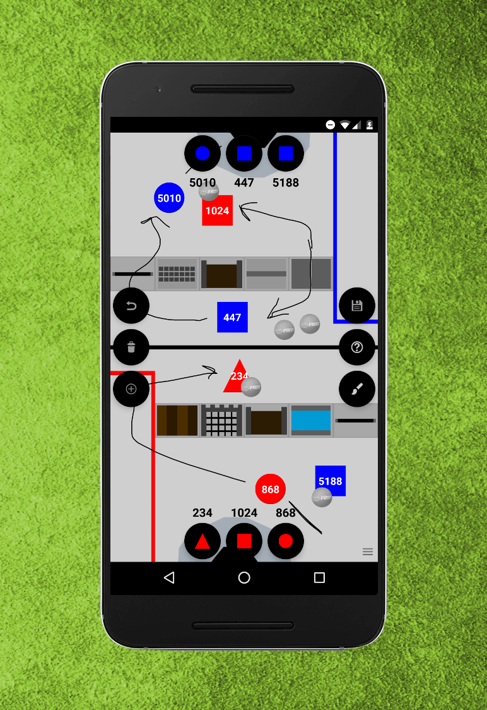

# FRC Gameplan

Download it now on Google Play!

https://play.google.com/store/apps/details?id=com.techhounds.frcgameplan

## Evolution of Gameplan

It is crazy to believe that FRC Gameplan is four years old. Let's look at the evolution

<table>
<tr>
  <th>2015</th>
  <th>2016</th>
  <th>2018</th>
</tr>
<tr>
  <td></td>
  <td></td>
  <td></td>
</tr>
</table>

I hope that you agree with me in saying that, the app definitely has improved in asthetic, function, and speed over the last four years. I cannot thank enough the people who have taught me along the way to develop an app like today's version.
### What happened to 2017?

For me, as the developer of Gameplan, it was a very busy and time and unfortuntely, I was not able to update the app for 2017.

### Why release the 2018 update in June?

Again, I was super busy during the time around build season, but I was able to make a release. Updating the app at some point is better than never. This also allows an opportunity for teams to use the app during the preseason, which could help down the road for the 2019 update.

### Future of Gameplan

I will be continuing to be updating the app unless someone from my former team (868) gets an opportunity to learn Android Development and is able to keep on developing this app. I will definitely make an effort to have this app ready by the end of 2019 build season for the 2019 game.
